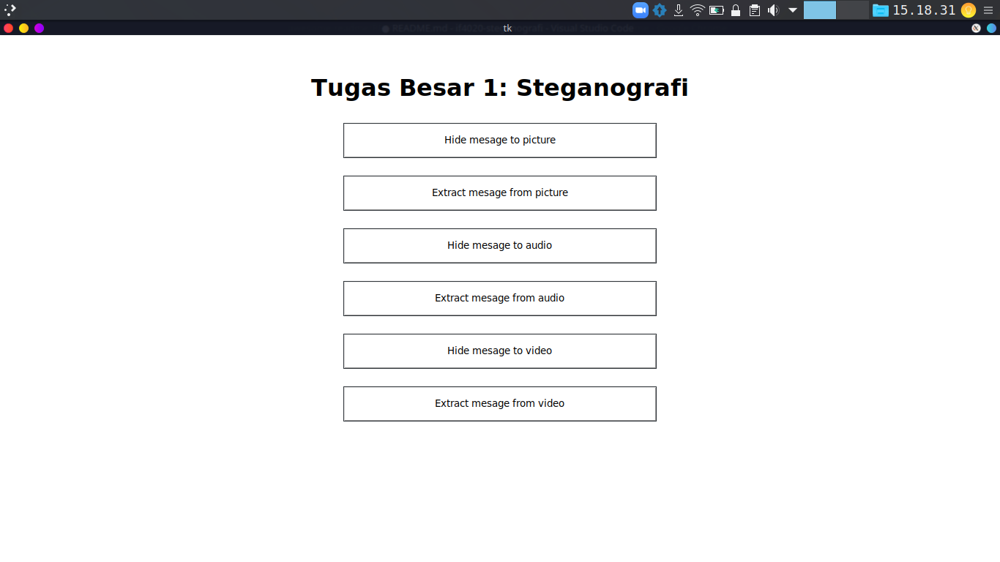
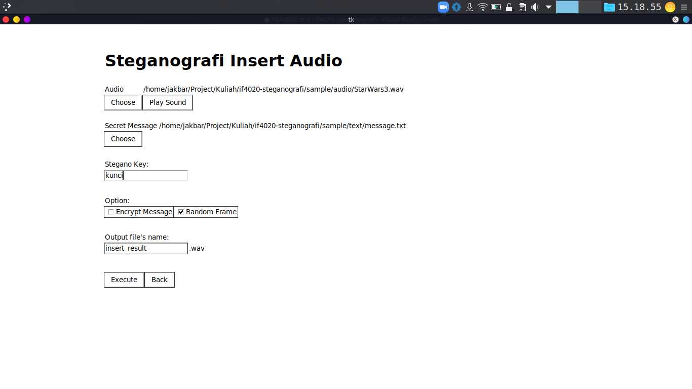
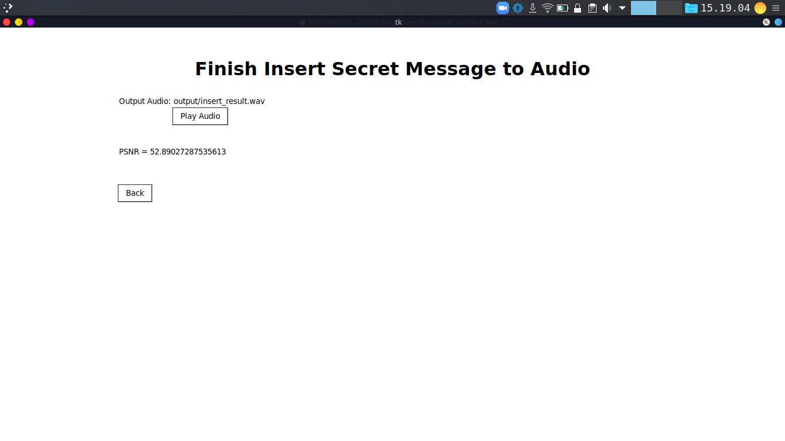

# IF4020 Steganografi

Tugas Besar IF4020 Kriptografi: Aplikasi Steganografi pada Berkas Citra, Audio, dan Video dengan Metode LSB dan Metode BPCS

# Demo Preview





## Instalation

To use this project, first clone the repo on your device using the command below:

```sh
git clone https://github.com/juniardiakbar/if4020-steganografi.git
```

Install dependency

```sh
pip3 install -r requirements.txt
```

Run GUI

```
python3 app.py
```
